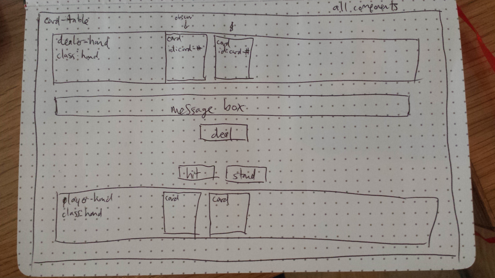

*** Ryan Edwards / 7/11/17 ***

## Blackjack Proposal

### What is Blackjack?

Blackjack is also known as 21, is a card game where a player (or players) face off against a dealer. The dealer and each player initially gets two cards. The player(s) can only see one of the dealer's cards. Their values are face value, except Aces and face cards (J, Q, K), which are 1 or 11 and 10, respectively. 

The player's goal is to get the sum of their cards higher than the sum of the dealer's cards, without that sum going over 21. The player can request additional cards (or 'hit') if they want to increase their chances of beating the dealer. When the player is satisfied, and have not gone over 21, they can end their turn (or 'stand').

When the player(s) has ended their turn, if sum of the dealer's hand is less than 16, the dealer will 'hit' until their hand is worth more than 16, at which point, the dealer stands. If the dealer goes over 21, the player(s) automatically wins.

After the dealer stands, the dealer's hidden card is revealed to the player(s), and if the sum of the players hand is higher than the dealer, the player wins.

Blackjack is frequently played in casinos, and players usually bet on winning. In this context, there are additional player options related to betting. The player can split their hand if their two initial cards are of equal value, doubling their bet and receiving two additional cards to go with each of the split cards to create two hands. They can then play each hand separately. They can also double their bet on their initial hand, and receive just one additional card.

### Wireframe

### Initial thoughts on game structure

The initial game logic should be fairly straightforward, creating a deck of cards (objects in an array) and manipulating them in the player hands (arrays). Accounting for the dual nature of ace might complicate a few things. I also want to keep track of the state of the deck and re-deal when then source deck is low on cards. The real challenge will emerge if I implement a betting aspect, a larger source deck, and/or multiple players. I'm currently considering those implementations Phase 1+, beyond the scope of the MVP. I also anticipate having the usual hassle with CSS getting it to look good. I want to implement CSS animations for the card dealing, hitting, and flipping, after I get it all working of course.

### Phases of Completion

First phase will be to create a deck of cards in JS, using an Object constructor, pulling from arrays of suits and values. The Card object will be comprised of suit, value, realValue (the numerical value of the card for adding purposes), and an image url. I'll then randomize the deck using the Fisher-Yates algorithm. 

Second phase, on the HTML side (maybe dynamically with jQuery, create a container div (the 'card table'), divs for the player and dealer hands, buttons to implement player actions, and a message box. Basic CSS rules will need to be in place to get the correct structure in place.

Third phase, implement the back-end JS gameplay logic, which will involve initializing the player hands as empty arrays and implementing a series of functions that deal random cards to each hand (twice each for the initial deal), calculate the sum of the hand arrays, checking for over 21, executing dealer logic, and stopping the game when a player has won or lost.

Fourth phase and will be to connect the gameplay logic to the DOM, changing DOM elements to reflect player hands, putting messages in the message box, and making it run in the browser.

Fifth phase will be to apply CSS and card face images, working on the styles and animations to make it look pretty.

Beyond that, will be to apply a reset function (might implement this in the third and fourth phase if all is going well), multiple players, and maybe even betting and betting options.

### Links and Resources

https://sourceforge.net/projects/vector-cards/

https://opengameart.org/content/playing-cards-vector-png

For playing card images after implementing game logic.
