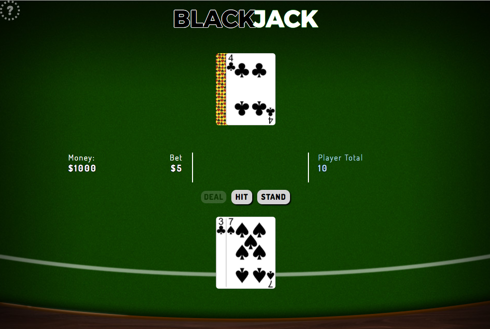

# Blackjack



## What is Blackjack?

Blackjack, also known as 21, is a card game where a player faces off against a dealer. The dealer and the player each initially get two cards. The player can only see one of the dealer's cards. The cards's are worth face value, except Aces and face cards (J, Q, K), which are 1 or 11 and 10, respectively.

The player's goal is to get the sum of their cards higher than the sum of the dealer's cards, without that sum going over 21 ('BUST'). The player can request additional cards (or 'HIT') if they want to increase their chances of beating the dealer. When the player is satisfied, and has not gone over 21, they can end their turn (or 'STAND').

When the player has ended their turn, if sum of the dealer's hand is less than 16, the dealer will 'HIT' until their hand is worth more than 16, at which point, the dealer stands. If the dealer 'BUSTS', the player automatically wins.

After the dealer stands, the dealer's hidden card is revealed to the player, and if the sum of the player's hand is higher than the dealer, the player wins. If they are equal, then it is a tie game, or 'PUSH'.

Blackjack is frequently played in casinos, and players bet a certain amount on winning. If the player wins, they get double their money back. If the player and dealer 'PUSH', the player gets only their initial bet back.

I chose to make this game because I thought it would be a good test of my abilities to create a game using all of the concepts we had learned so far, from HTML to CSS to Javascript.

## Technical Discussion

This game made heavy use of Javascript, and CSS, with a barebones HTML file that was filled in dynamically using jQuery.

### Notes on Game Structure

```javascript
// ADDS A CARD TO THE INDICATED PLAYER'S HAND, UPDATES PLAYER TOTAL
// ADJUSTS CALCULATION IF ACE IS PRESENT
function hitMe(turn) {
  let $newCard = ($('<div>', {'class': 'card removed'}));
  let newCard = deck.shift();

  $newCard.css('background-image', `url('${newCard.img}')`);

  turn.hand.push(newCard);
  $newCard.attr('id', `${turn.name}-card-${turn.hand.length}`);
  turn.$hand.append($newCard);

  turn.total = calculateHand(turn);

  $(`#${turn.name}-total p`).text(turn.total);

  checkForAce(turn);

};
```
Above is a code sample of my "hitMe" function. I feel it represents a good cross-section of my game structure.

Some unforeseen challenges included realizing that setTimeout does not delay code execution and learning how to preload images so that my card animations would work properly when the game was deployed online.

The latter challenge culminated in the below code snippet, which I was pleased when it worked right away:

```javascript
// PRELOADS CARD DECK IMAGES
function prefetchDeckImages() {
  deck.forEach((card) => {
    let $imageLink = $('<link>', {'rel': 'prefetch', 'href': `${card.img}`});
    $('head').append($imageLink);
  });
};
```

## The Making of Blackjack

Thanks to Philip Zak for saying 'hey, you should make blackjack', and my wife Yue for putting up with my obsessively working on this game.  And all the guys at the table for the emotional support when CSS had me in a glass cage of emotion.

Also thanks to the Queens County court system for letting me off the hook for jury duty, and the internet in general for having answers to all the questions.

## Opportunities for Future Growth

If I had more time, I would implement splitting hands and doubling down, as well as insurance for when the dealer is showing an ace, which indicates a possibly blackjack. I would also continue making the site more reactive and look better at various viewport standards. I might even add music and sound!
